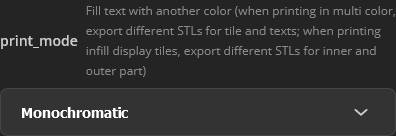
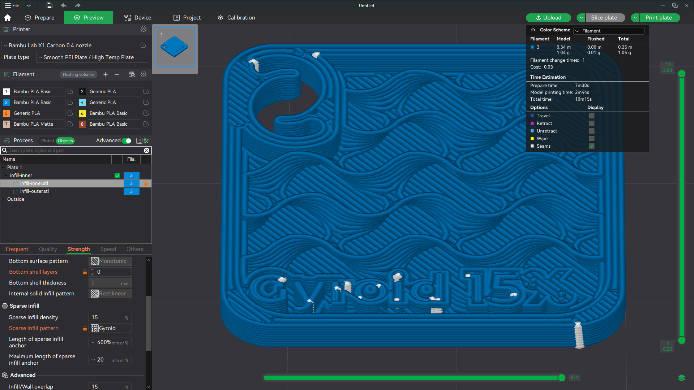

# Ultimate fully customizable swatches generator

This is an [OpenSCAD](https://openscad.org/) script to generate filament and infill swatches tiles for display.

This script has been published and can be found and used directly on [MakerWorld](https://makerworld.com/en)'s [page](https://makerworld.com/en/models/481721).

Please be sure to also check the swatches holder generator script you can find [here](https://github.com/zizzo81/swatches-holder).

## Summary

- [Two scripts for two nozzles](#two-scripts-for-two-nozzles)
- [Errors and warnings](#errors-and-warnings)
- [Text clipping](#text-clipping)
- [A guide through the tabs of parameters](#a-guide-through-the-tabs-of-parameters)
  - [Texts](#texts)
  - [Text 1 (upper side)](#text-1-upper-side)
  - [Text 2 (below text 1)](#text-2-below-text-1)
  - [Texts 3, 4 and 5 alignment](#texts-3-4-and-5-alignment)
  - [Text 3 (below hole)](#text-3-below-hole)
  - [Text 4 (between text 3 and 5)](#text-4-between-text-3-and-5)
  - [Text 5 (lower-left corner)](#text-5-lower-left-corner)
  - [Infill display tile](#infill-display-tile)
  - [3D printing settings](#3d-printing-settings)
  - [Tile sizes](#tile-sizes)
  - [Hole position and sizes](#hole-position-and-sizes)
  - [Tweaks (fix things up)](#tweaks-fix-things-up)
- [What you can create](#what-you-can-create)
  - [Monochromatic swatches](#monochromatic-swatches)
  - [Infill display swatches](#infill-display-swatches)
  - [Multi color swatches on mono printers or for non AMS compatible filaments (using pause at layer/height)](#multi-color-swatches-on-mono-printers-or-for-non-ams-compatible-filaments-using-pause-at-layerheight)
  - [Multi color swatches on multi color printers](#multi-color-swatches-on-multi-color-printers)
- [Version history](#version-history)
- [Thanks](#thanks)

## Two scripts for two nozzles

There are two versions of the script, they're the same exact code, but each one has presets for printing using different nozzle size.

| **Setting**        | **for 0.2mm nozzle** | **for 0.4mm nozzle** |
| ------------------ | -------------------- | -------------------- |
| First layer height | 0.1mm                | 0.3mm                |
| Layers height      | 0.1mm                | 0.2mm                |
| Safe border        | 0.6mm                | 1.2mm                |

The standard height of a tile is 2.1mm, also if this parameter is configurable, the script is created taking this in consideration: layers height and initial layers height must be compliant with this parameter. Hence, for the 0.4mm nozzle version we have one initial layer of 0.3mm and 9 consecutive layers of 0.2mm. As math tells us 0.3 + 9 * 0.2 = 2.1.

If this parameters is not match, a warning will be shown.

## Errors and warnings

I implemented a dirty and rapid system to showing warnings and errors in this script, as OpenSCAD does not provide this being a procedural language that always produces an output. Hence if an error occurs, the script will render a big icon representing a triangle with an inset exclamation mark and create a text that describes the error. The same happens when a warning needs to be shown, but you can skip warnings by activating the **disable_warning** parameter in the **Tweaks (fix things up)** tab.

You can also choose the language in which errors and warning are shown. Currently supports only **english** (default) and **italian**. To change this, always under the Tweaks (fix things up), select the desired language in the **errors_language** parameter.

## Text clipping

This script is clipping excesses of generated texts.

Every shape of text that is going outside the shape of the tile is truncated.

All around the shape and the hole, there's a safety border which is cutting texts for avoiding having texts over the borders.

The width of this border can be set by changing the value of the **safe_border** parameter in the **3D printing settings** tab.

## A guide through the tabs of parameters

Here's an detailed explanation of every possible setting. Feel free to explore the endless possibilities of combining these values.

### Texts

The most commonly customization is writing on the tile. This script provides a way to write up to five sentences on five separated lines vertically distributed. In this section you can set the texts you want to display, if you leave a field empty, that text will not be rendered. Each text also has his own section to change all the settings of how and where it has to be rendered (see below).

| Parameter | Description                                                  | Default      | Def. align. |
| --------- | ------------------------------------------------------------ | ------------ | ----------- |
| text_1    | The first text is located by default neat the upper-right corner of the tile. | “Code”       | Right       |
| text_2    | The second text is automatically located under the first text. | *empty*      | Right       |
| text_3    | The third text is located below the hole or, if the second text exceeds the limit of the hole, below the second text.Also please note that there's a special tab called **Texts 3, 4 and 5 alignment** where you can set if this text is immediately below the hole / second text or the three texts are aligned to the bottom of the tile (default). | “Brand Name” | Left        |
| text_4    | The fourth text is vertically centered in the middle of the third and the fifth text. | “Material”   | Left        |
| text_5    | The fifth text is located at the bottom of the tile.         | “Color”      | Center      |
| text_6    | This is the only text shown on the infill display tiles at bottom. | “Gyroid 15%” | Left        |

### Text 1 (upper side)

In this section you will find all the parameters that influence the rendering of the first text.

Note that the other sections have the same options that apply to the other texts.

| Parameter          | Description                                                  | unit | min  | max  | default         |
| ------------------ | ------------------------------------------------------------ | ---- | ---- | ---- | --------------- |
| text_1_direction   | This defines the direction where the text extends, if can **Extrude** out above the level of the tile, or **Chisel** inside the tile.   |      |      |      | Chisel          |
| text_1_height      | This defines the height of extrusion or chisel.   | mm   | 0.1  | 5    | 0.4             |
| text_1_font        | Selects the font of the text. Choose the font you like most, but keep an eye on printability of fonts. |      |      |      | Liberation Mono |
| text_1_custom_font | Here you can override the above setting by putting the name of a font installed in the system where this script is executed. Please keep in mind that when you use Parametric Model Maker, the system the script is running on is MakerWorld's server, not your computer. |      |      |      | *empty*         |
| text_1_style       | Choose the style of the text. **Note:** not all fonts support all styles. |      |      |      | Bold            |
| text_1_size        | The size of the text.                                        | pt   | 1    | 12   | 2.5             |
| text_1_align       | The alignment of the text, this value can be: - **Left** - text is aligned with the left side of the tile; - **Center** - text is centered horizontally in the tile; - **Right** - text is right aligned with right side of the tile. |      |      |      | Right           |
| text_1_spacing     | Spacing between the letters, the greater the number, the far the letters are. |      | 0.1  | 5    | 1               |
| text_1_x_offset    | X offset of the text to compensate and correct calculated position. Be warned that changing this value does not only change the position of current text, but also of texts which position is computed relative to this text. | mm   | -100 | 100  | 0               |
| text_1_y_offset    | Same as above, but for Y axis.                               | mm   | -100 | 100  | 0               |

### Text 2 (below text 1)

Same options as in *Text 1 (upper side)* section, but applies to text 2.

### Texts 3, 4 and 5 alignment

| Parameter   | Description                                                  | default         |
| ----------- | ------------------------------------------------------------ | --------------- |
| texts_align | This parameter specifies how texts 3, 4 and 5 are vertically distributed. Possible values are: - **Distribute between hole and bottom** - text 3 is just below the hole and optionally spirals, text 5 is aligned to bottom, while text 4 is vertically centered between text 3 and 5; - **Align to bottom** - all text are aligned to bottom, one above the other. | Align to bottom |

### Text 3 (below hole)

Same options as in *Text 1 (upper side)* section, but applies to text 3.

### Text 4 (between text 3 and 5)

Same options as in *Text 1 (upper side)* section, but applies to text 4.

### Text 5 (lower-left corner)

Same options as in *Text 1 (upper side)* section, but applies to text 5.

### Infill display tile

This is the line of text that appears in the bottom of the tile when creating a Infill display tile.

Since this is a text, it has the same options as in *Text 1 (upper side)* section, but extrusion/chisel can also have a value of zero.

| Parameter           | Description                              | unit | min  | max  | default |
| ------------------- | ---------------------------------------- | ---- | ---- | ---- | ------- |
| display_tile_height | The height of the infill display height. | mm   | 0    | 5    | 0.5     |

### 3D printing settings

The parameters that can be found here are already described all around this guide.

### Tile sizes

| Parameter   | Description                                                  | unit | min  | max  | default |
| ----------- | ------------------------------------------------------------ | ---- | ---- | ---- | ------- |
| tile_size   | Being the tile a rounded-corners square, this defines the length of the side of that square. | mm   | 10   | 100  | 24      |
| tile_height | As described on top of this document, this is the desired tile height, but is strictly tied to layers height. | mm   | 1    | 5    | 2.1     |
| tile_radius | This sets the roundness of the above mentioned square.       | mm   | 1    | 10   | 3.1     |

### Hole position and sizes

| Parameter                   | Description                                                  | unit    | min  | max  | default |
| --------------------------- | ------------------------------------------------------------ | ------- | ---- | ---- | ------- |
| cut_hole                    | If this option is disabled, no hole nor spirals are cut in the tile, which will result in a solid rounded-corner square and all other parameters in this tab are useless. | bool    |      |      | true    |
| cut_spirals                 | If this option is disabled, spirals will not be cut around the hole, making all parameters relative to spiral useless. | bool    |      |      | true    |
| hole_x_offset               | The distance from the left border of the tile and the center of the hole. | mm      | 1    | 10   | 3.9     |
| hole_y_offset               | The distance from the top border of the tile and the center of the hole. | mm      | 1    | 10   | 4.6     |
| hole_diameter               | The diameter the hole has, should be the same - with approximation - of the receiving pin or the chain you're inserting the swatches into. | mm      | 1    | 5    | 3.1     |
| spiral_diameter             | The stroke to use when cutting the spirals.                  | mm      | 1    | 5    | 1       |
| spiral_distance             | The distance of the center of the stroke of spirals from the center of the hole. | mm      | 1    | 10   | 3       |
| spiral_angle                | The starting angle of the spiral, in this way you can orientate spirals all around the hole. | degrees | 0    | 180  | 120     |
| spiral_correction           | The length of the pin holders creation.                      | degrees | 0    | 90   | 40      |
| spiral_correction_extension | The length of the pin holders creation.                      | degrees | 0    | 90   | 15      |

### Tweaks (fix things up)

Not inserting in this section the parameters that are already described somewhere else in this guide.

| Parameter               | Description                                                  | min  | max  | default |
| ----------------------- | ------------------------------------------------------------ | ---- | ---- | ------- |
| curves_quality          | Selects the quality of curves to be used when generating the model, the lowest the quality, the faster generation will take. You can work in Draft all the time for fast refresh, but you need to remember to switch back to Normal or something higher before exporting the model to be printed.  Possible values: - **Draft** - low quality, not suitable for printing; - **Printable draft** - not for production, yet printable; - **Normal**: normal quality, ready to print; - **High quality**: good quality for high resolution printers.  **Be warned:** Parametric Model Maker has a short timeout for script execution to avoid DDoS attacks, for this reason setting a quality too high could create a timeout error |      |      | Normal  |
| magic_text_height_ratio | It's the ratio between the nominal height of a text (for example the above 2.5 of text 1) and the physical distance between the top face of an extruded uppercase letter (e. g.: "T" or “M”), and the bottom face of a letter extending below the baseline (e. g.: “q”, “y”, “g”).   To obtain this value for more accurate positioning, set the font you desire and the nominal size, then extrude and export a piece with “Tq” as text. Use the Bambu Studio measure tool to check the distance.    This gives you 3,1mm, to calculate the ratio the proportion is 2.5 : 1 = 3.1 : *x*, which means *x* = 3.1 / 2.5, which is 1.24. This font has a magic ratio of 1.24. | 0.01 | 3    | 1.33    |

## What you can create

### Monochromatic swatches

The easiest one, nothing to say: create a swatch as you want it.

An example swatch to be printed using a single color.

Make sure you selected **Monochromatic** for the parameter **print_mode** in the **3D printing settings** tab as shown in the image above.

Remember to left click on  to generate a version with your current settings.

Click the  button to download the object to a file.

When this windows pops up, left click on the  button to select the .STL file format.

If your computer offers the possibility to save the file to a desired location, select a folder where you want to save it and choose a proper name, e. g. “monochromatic”, which fill create “monochromatic.stl”.

If your browser is configured to automatically save files, you will find the file named “Compatible color swatch 0.*x* nozzle.stl” (where *x* is the dimension of the chosen nozzle) in the location you usually receive downloaded file, usually called the “Downloads” folder.

Open [Bambu Studio](https://bambulab.com/en/download/studio) or your preferred slicer, start a new project and drag the file onto it.

Make sure these settings in your slicer, exactly matches these settings in the [Parametric Model Maker](https://makerworld.com/en/makerlab/parametricModelMaker).

Other settings are up to the user choice, you can now slice the plate and print it.

Sample result of the above operations.

### Infill display swatches

Please read the previous section *Monochromatic swatches* for basic information about how to manage the whole process before continuing.

When creating an infill swatch, we need to follow a slightly different path, here's how to do it.

Make sure you selected the **For infill display - outer part** in the **3D printing settings** tab.

Make sure to fill all the parameters in the **Infill display tile** tab.

Click on the **Generate** button.

Export this to a STL file (let's say “infill-outer.stl”.

Change the **print_mode** parameter to **For infill display - inner part** and click on **Generate** again.

Export this to a STL file, let's say “infill-inner.stl”.

Open a new project in Bambu Studio and drag both file at the same time on it.

When asked if these has to be considered two parts of a single object, select **Yes**.

Remember to make sure *Layers height* and *Initial layer height* match between your Bambu Studio project and the generator script parameters.

Now follow these steps:

1. Switch to the **Objects** section;
2. Select the infill-inner.stl object;
3. Go to the **Strength** tab;
4. Set **Wall loops** to **0**;
5. Set **Top shell layers** to **0**;
6. Set **Bottom shell layers** to **0**;
7. Set **Sparse infill density** to the value you declared in you tile text - if you did, or to a desired value anyway;
8. Set **Sparse infill pattern** to the pattern you want to display in the tile.

A good preview of what's going to be printed is shown after you slice your plate.

You're ready to print it.

Sample of the above operations.

### Multi color swatches on mono printers or for non AMS compatible filaments (using pause at layer/height)

Please read the *Monochromatic swatches* section for basic information about how to manage the whole process before continuing.

A limitation of the monochromatic printer can be partially bypassed, printing the texts with another color by using some clever tricks, here's how to do it.

First of all make sure you designed your tile with all the texts as extruded, this will not work with chiseled texts.

Export it as STL and import into Bambu Studio following the same instructions for monochromatic printing until you reach the step where you slice it.

Once you sliced the plate, use drag the **+** icon of the vertical scrollbar down.

The **+** icon in the vertical scrollbar.

As you scroll top layers will disappear from view, continue scrolling down until only one layer with texts is visible.

Now, right click on the **+** icon and a menu will pop out.

Select the **Add Pause** item, the you will have to slice the plate again.

Once you sliced it again, the scrollbar will show a “Pause” label where you set it and the layer will be drawn with another color.

Now print this, when the printer is starting to print that layer, it will pause and the print head will be moved away from the piece and on the screen you will see a message.

Change the filament in the printer, then press **Resume** to continue printing using the new color.

In my opinion, results are beautiful.

### Multi color swatches on multi color printers

Please read the *Monochromatic swatches* section for basic information about how to manage the whole process before continuing.

The most easy way to print these, yet the most satisfying way to customize this.

Once you draw your tile, be sure to select the **Tile only** option for the **print_mode** parameter in the **3D printing settings** tab and click on **Generate**.

Click the **Download** button to export to a STL file, let's say tile.stl.

Change the **print_mode** parameter to **Texts only** and click **Generate** button again.

Click **Download** again and export this to a STL file and call it texts.stl.

Open a new project in Bambu Studio and drag both file at the same time on it.

When asked if these has to be considered two parts of a single object, select **Yes**.

Remember to make sure *Layers height* and *Initial layer height* match between your Bambu Studio project and the generator script parameters.

Now follow these steps:

1. Switch to the **Objects** tab by left clicking on the Global/Objects switch;
2. Right click on the texts.stl line in the objects list;
3. Move with the mouse over the **Change filament** menu item;
4. From the sub menu select the filament you want.

This procedure has been designed to work with both chiseled, extruded and on fill modes.

## Version history

| Date       | Description                                                  |
| ---------- | ------------------------------------------------------------ |
| 2024-06-08 | Included all fonts thanks to [@Stephanos](https://makerworld.com/en/@Stephanos). Corrected Text 1 X-offset default value. Corrected tile size precision. Created a more readable guide using tables. |
| 2024-06-01 | First public release                                         |

## Thanks

Thanks to [@Stephanos](https://makerworld.com/en/@Stephanos) for the complete list of fonts and styles supported by MakerWorld he gave me access with his script **Parametric Model Maker ALL TEXT FONTS TEMPLATE** you can find [here](https://makerworld.com/en/models/484918).

